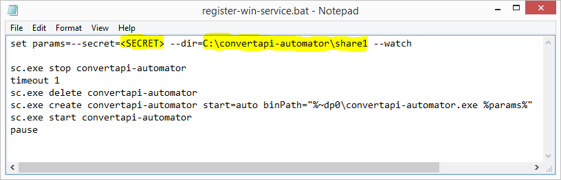
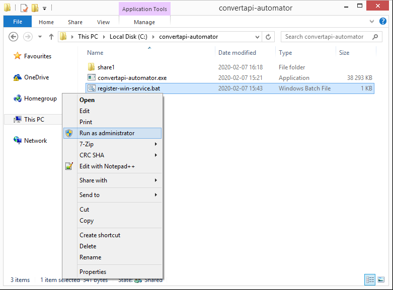

# **Automate file format conversions** without installing software into your office workstations
In every company employees that work with documents need to convert files from one format to another (e.g. `docx` to `pdf`).
To make work more efficient file conversion should be a fast and simple task, something like copying a file into a directory.
Led by this idea we developed a **file conversion tool** that is easy to use, configure and maintain.
Using convertapi-automator is as easy as copying files into the input directory and retrieving converted files from the output directory.

Quick facts about automation tool:

- Converting files from input to output directories.
- Can be installed on a server and used by workstations.
- Conversions and conversion parameters can be modified on workstations.
- Open source software. It is completely free and can be modified as needed.
- Cross Platform. Developed using most recent Microsoft .NET Core technology.
- Can run as a service (daemon) or classic CLI application.
- Using [convertapi.com](https://www.convertapi.com) API service.
 
## Summary (TL;DR)
Short list of steps that will help you set up a running convertapi-automator windows service.
Further in this article you will find more details about these steps.

- [Download convertapi-automator](https://github.com/ConvertAPI/convertapi-automator) and [service registration script](https://raw.githubusercontent.com/ConvertAPI/convertapi-automator/master/Cli/register-win-service.bat). 
- [Register on convertapi.com](https://www.convertapi.com/a/su) and get your secret key.
- Create `C:\convertapi-automator\share1\pdf` directories and share `C:\convertapi-automator\share1` directory with R/W permissions.
- Replace text `<SECRET>` with your convertapi.com secret in `register-win-service.bat` file.
- Run `register-win-service.bat` as an administrator.
  

## Let's automate file conversions on Windows network
While other platforms are gaining popularity Windows still stays the most popular desktop OS used in business.
Assuming that your office is using Windows, let's make file format conversion simple for all of your office workstations.

This **file conversion application** can be ran as **Windows service**.
When an automator is running as a service it is watching input directories for new files to appear and converts them immediately.

### **Download file converter**
convertapi-automator tool is just one executable file that doesn't require installation and can be placed anywhere you like.
In this tutorial we will use `C:\convertapi-automator` directory for storing executables and input directories.

Go to https://github.com/ConvertAPI/convertapi-automator to download compressed executable and extract it to `C:\convertapi-automator`.

### Register to convertapi.com
convertapi-automator is using convertapi.com API.
You need to [register](https://www.convertapi.com/a/su) to get your secret key and trial conversion time. 

### Prepare input and output directory structure
Inside `C:\convertapi-automator` directory create a `share1` subdirectory and share it to other office workstations with `read/write` permissions.
`C:\convertapi-automator\share1` will be used as input directory for files that will be converted.

Edit `register-win-service.bat`

Replace `<SECRET>` with your convertapi.com secret.
Make sure that `--dir=` correctly points to shared input directory.
Save the file and run `register-win-service.bat` as administrator.

After executing the bat file you should see the `convertapi-automator` service running inside `Services` window.

### Test your setup 
Create subdirectory inside `C:\convertapi-automator\share1` named as required destination format e.g. `pdf`.
**Copy** `docx` or any other office document file into a `C:\convertapi-automator\share1` directory.
It may seem that the file is not getting copied but that's ok, it just gets moved to a temporary folder as the file copying is finished. 
**IMPORTANT!!!** ALWAYS COPY NEVER MOVE files into the input directory as they will be instantly **DELETED**.
 Open `C:\convertapi-automator\share1\pdf` directory and in a few seconds (time depends on input file size) converted `pdf` file will appear.

### Convert from workstation
Open shared directory on any of your workstations.
**Copy** `docx` or any other office document file into the shared directory.
Open `pdf` subfolder and converted file will appear there as soon as conversion is finished. 

## Final thoughts
We just learned one of the many use cases of convertapi-automator.
There are more advanced features that are available on convertapi-automator such as:

- Multiple input directories
- Conversion configurations
- Conversion chaining

Read more about these features on [convertapi-automator Github page](https://github.com/ConvertAPI/convertapi-automator)
